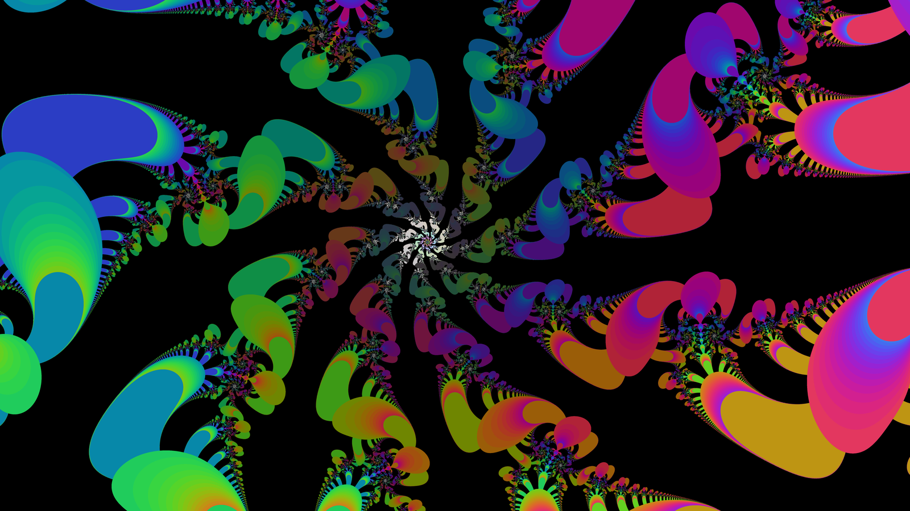
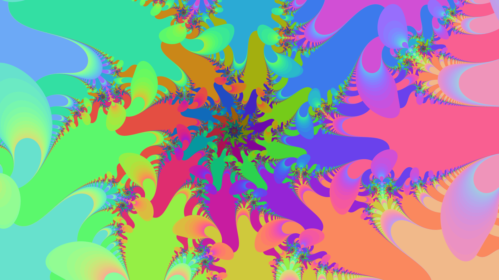

# Fractal Studio



Interactive fractal explorer and **GPU-accelerated** video renderer.
Python + PySide6 + Numba (CPU and CUDA).

Explore escape-time fractals — Mandelbrot, Julia, Burning Ship, Tricorn, and
any custom formula `f(z, c)` you type — plus Newton multi-attractor basin
fractals. Dive to ~10^13 magnification with click-to-zoom navigation and
bookmarks, then render high-resolution stills, smooth 4K zoom-in videos, and
seamlessly looping Julia morph videos. On a machine with NVIDIA GPUs, frames
render up to **62x faster per GPU** and shard across all available GPUs; on
anything else, the same code runs on all CPU cores automatically.

## Made with Fractal Studio

Julia morph animations — the constant c traveling a small circle in the
complex plane while the set writhes in response — scored with original
sitar/sarod/tabla ragas (one with vocals):

* https://youtu.be/RkQgGoY6Cek
* https://youtu.be/VYpVeOAjovA
* https://youtu.be/EOrAn7sN_io
* https://youtu.be/PjE8xM07j_Q
* https://youtu.be/b0IPI39v2ec

The stills above and below are frames from an animation of the Julia set of
**exp(z) + c** — the exponential family, whose Julia sets form "Cantor
bouquets" of hair-like tendrils and reorganize dramatically as c moves.



## Features

* **Fractal families**: escape-time presets (z^2+c through z^4+c, Burning
  Ship, Tricorn, Lambda, Sine, Exponential), a free-text formula box —
  expressions in `z` and `c` are validated by a whitelist AST parser and
  JIT-compiled into parallel kernels — and Newton basins for any polynomial,
  colored by attracting root with smooth convergence shading.
* **GPU rendering** (NVIDIA, optional): CUDA twins of the escape-time kernels
  with a float32 fast path, automatic `precision='auto'` selection, and
  transparent CPU fallback. Deep views (span < 1e-4, where float32 runs out
  of resolution) automatically use the CPU float64 path; a span-space
  crossfade band makes the f32-to-f64 handoff invisible in zoom videos.
* **Multi-GPU video pipeline**: frames shard across all GPUs through a
  producer/consumer pipeline with in-order encoding, bounded memory, and
  parallel PNG writing.
* **Navigation**: click to zoom (recenters, default x10), shift-click to zoom
  out, wheel zoom anchored under the cursor, drag to pan, history
  back/forward, bookmarks, and right-click to open the Julia set of any point.
* **Color**: smooth (fractional-iteration) coloring quantized onto 256-entry
  palettes; palette sources include gradients, JSON files, and paths on the
  sphere inscribed in the RGB cube (great circles and pole-to-pole spirals —
  vivid colors that blend and wrap seamlessly). Live color density/offset,
  log mapping for deep zooms, and palette cycling in either direction —
  all recolor instantly from a cached iteration field, no re-render.
* **Video**: 4K-default zoom videos specified as zoom-rate-per-second; Julia
  morph videos along circle / spiral / line paths in c-space (circle paths
  loop seamlessly), combinable with zooming; CRF quality control; optional
  PNG frame sequences; render-time and file-size estimates *before* you
  commit; and an **in-app low-res Preview** that loops the exact animation
  path in seconds-to-minutes — no video file, no codecs — so you tune
  parameters before the real render.
* **Reproducibility**: bookmarks ("location" JSONs) store everything —
  center at full float64 precision, formula, palette, color settings — and
  every saved still gets a sidecar location file.

## Performance

Measured on 4x GTX TITAN X (Maxwell) + i7-5930K; 4K frame, Mandelbrot,
max_iter=1000 (reproduce: `python scripts/cuda_verify_bench.py`):

| path                     | time    | vs CPU |
|--------------------------|---------|--------|
| CPU float64 (12 threads) | 1.26 s  | 1.0x   |
| GPU float32 (1 Titan X)  | 0.020 s | 62x    |

End-to-end ~10 s 4K clip through the 4-GPU pipeline: 1.5x (MP4) to 2.0x
(MP4 + PNG sequence) over single-GPU sequential — the render itself is no
longer the bottleneck. Notably, on Maxwell a *float64* GPU port is slower
than the CPU (FP64 runs at 1/32 FP32 rate); the float32 fast path required
AST-level kernel specialization. Details: `docs/workstreamA_bench.md`.

## Install

```bash
conda env create -f environment.yml
conda activate fractal
python main.py
```

The env includes `cudatoolkit=11.8` for the GPU path (chosen for full
Maxwell/sm_52 support; works on newer GPUs too). No NVIDIA GPU? Everything
still works — rendering falls back to Numba-parallel CPU automatically.

Notes: PySide6 must come from conda-forge (as the env file does) — pip's
PySide6 wheels require glibc >= 2.28 and fail on e.g. Ubuntu 18.04. A pip-only
CPU install (`requirements.txt`) works on Ubuntu 20.04+ if you don't need GPU.

## Controls

| Action | Effect |
|---|---|
| left-click | zoom in (default x10), recentered on the point |
| shift + left-click | zoom out |
| left-drag / wheel | pan / zoom x1.5 anchored at cursor |
| right-click | open the Julia set with c = clicked point |
| `H` / `Backspace` / `Shift+Backspace` | home / back / forward |
| `Ctrl+B` / `Ctrl+S` | bookmark / high-res image |
| `Ctrl+L` / `Ctrl+O` | save / load location |
| `Ctrl+Shift+Z` / `Ctrl+Shift+J` | zoom video / Julia morph video |

First render of a new formula pauses a moment for JIT compilation, then it's
cached for the session.

## Limits and roadmap

* Zoom depth is float64-limited (~10^13); the app clamps there. Perturbation
  rendering (f64 reference orbit + f32 per-pixel deltas — which would also
  put *deep* frames on the GPUs) is the planned v2 depth solution.
* GPU colorize/downsample (now the dominant per-frame cost at supersample 2)
  and a Newton CUDA twin are the next acceleration steps.
* Neural frame filters (DeepDream, style transfer) live in a separate
  project: https://github.com/shimmeringvoid/Deep_Dream — the two connect
  through PNG frame sequences.

## Layout

```
main.py               entry point
core/formulas.py      presets, formula parser, CPU + CUDA kernel codegen,
                      Newton kernels, precision selection
core/engine.py        view math, tiled rendering, colorization, precision
                      handoff blending, locations
core/palette.py       rainbow / sphere-path / gradient palettes, cycling
core/video.py         zoom + morph video pipelines, multi-GPU frame sharding
gui/                  main window, dialogs, in-app animation preview
scripts/              reproducible GPU verification / handoff / pipeline benches
docs/                 benchmark results and design rationale
locations/ palettes/  bundled bookmarks and palettes
```
